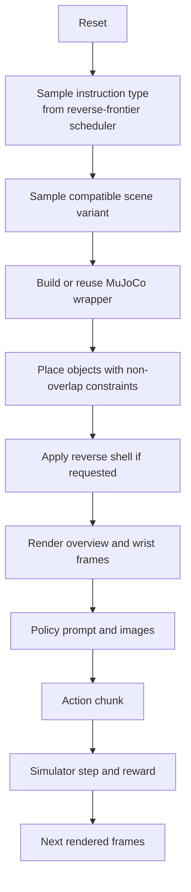
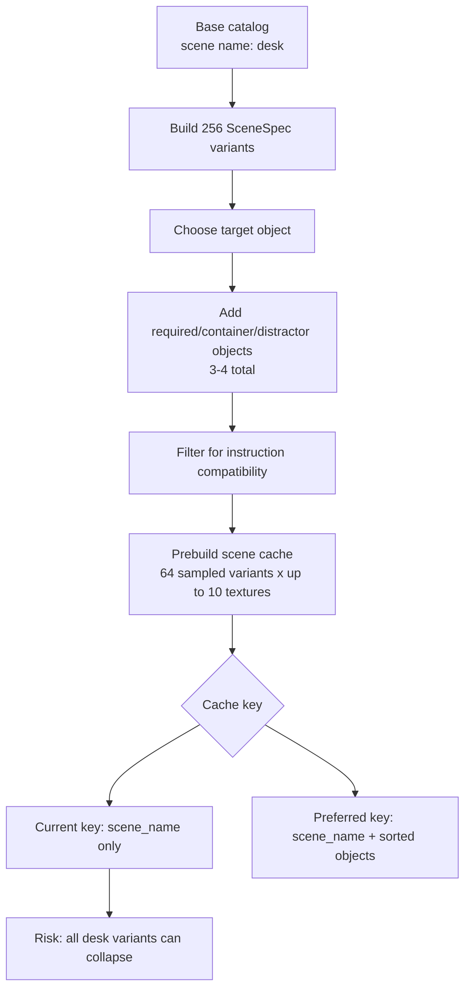
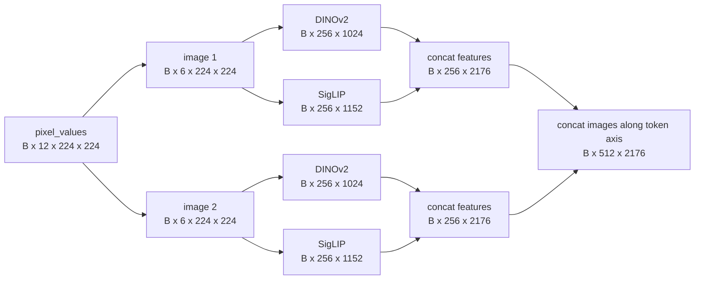
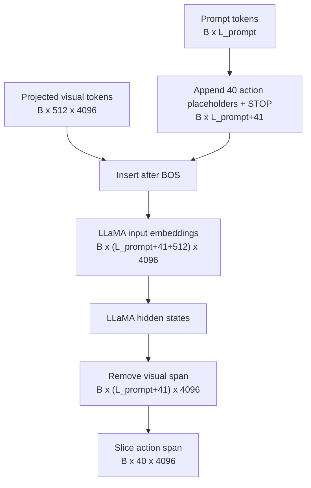
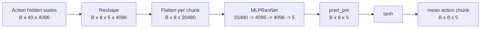
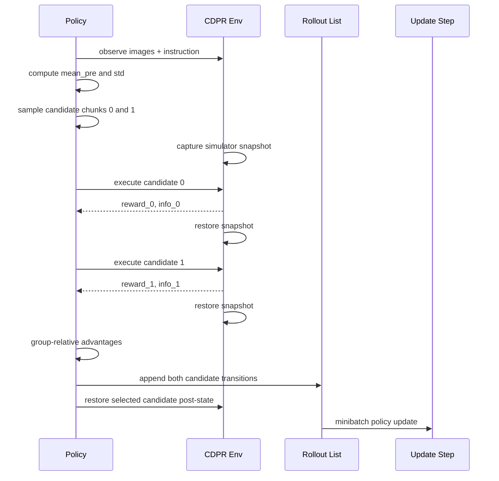
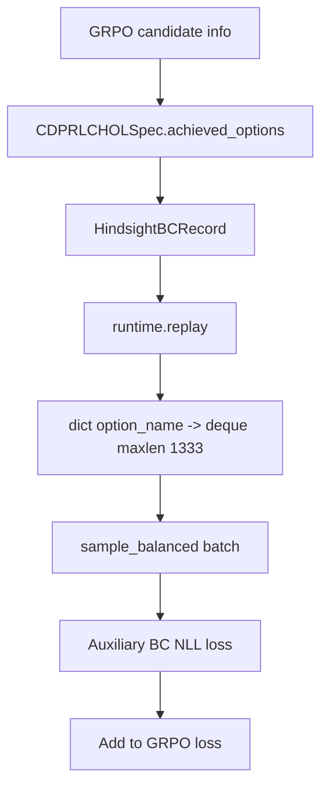
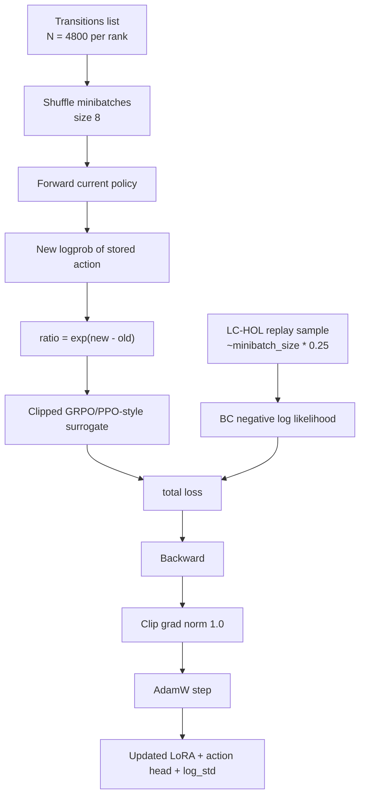

# CDPR OpenVLA Reverse-Frontier Full Pipeline Report

Date: 2026-05-26

This report describes the active complex-task pipeline in `configs/examples/cdpr_openvla_grpo_complex_tasks.yaml`: how online data is generated, how images and text pass through OpenVLA, how the action head produces CDPR actions, where OFT/LoRA adapters sit, how rollouts are collected, where replay buffers live in memory, and how GRPO plus LC-HOL hindsight BC updates the policy.

## Active Pipeline Summary

The complex-task run is not an offline supervised training pipeline. It is an online RL loop:

1. MuJoCo/CDPR generates a randomized scene and instruction.
2. The simulator renders two RGB views: overview and wrist/end-effector camera.
3. OpenVLA receives the instruction prompt plus both images.
4. DINOv2 and SigLIP vision transformers encode the images.
5. A fused projector maps visual patch features into the LLaMA hidden space.
6. LLaMA processes `[BOS] + visual tokens + prompt/action placeholders`.
7. The continuous action head maps the 40 action-token hidden states to an 8-step chunk of 5-D CDPR actions.
8. GRPO samples candidate action chunks from a squashed Gaussian around that action-head output.
9. The simulator evaluates candidate chunks from the same state snapshot.
10. Group-relative advantages update LoRA adapters, the action head, and actor log standard deviation.
11. LC-HOL captures achieved-option hindsight records into an in-memory per-option replay buffer and adds an auxiliary BC loss.


## Source Entry Points

Primary config:

- `configs/examples/cdpr_openvla_grpo_complex_tasks.yaml`

Main local wrapper:

- `rl_vla_bootstrapping/policy/grpo_finetune_cdpr_fast.py`

External OpenVLA-OFT trainer:

- `/Users/damirnurtdinov/Desktop/My Courses/Диплом/openvla-oft/vla-scripts/grpo_finetune_cdpr.py`

Model/runtime files:

- `/Users/damirnurtdinov/Desktop/My Courses/Диплом/openvla-oft/vla-scripts/ppo_finetune_cdpr.py`
- `/Users/damirnurtdinov/Desktop/My Courses/Диплом/openvla-oft/prismatic/extern/hf/modeling_prismatic.py`
- `/Users/damirnurtdinov/Desktop/My Courses/Диплом/openvla-oft/prismatic/models/action_heads.py`
- `/Users/damirnurtdinov/Desktop/My Courses/Диплом/openvla-oft/prismatic/vla/constants.py`

Environment and curriculum files:

- `robots/cdpr/cdpr_dataset/rl_cdpr_env.py`
- `robots/cdpr/cdpr_dataset/rl_instruction_tasks.py`
- `robots/cdpr/cdpr_dataset/cdpr_reverse_shells.py`
- `robots/cdpr/cdpr_dataset/cdpr_lchol_spec.py`
- `rl_vla_bootstrapping/lchol/grpo_runtime.py`
- `rl_vla_bootstrapping/lchol/replay_buffers.py`
- `rl_vla_bootstrapping/lchol/frontier_scheduler.py`

Cached base model config inspected locally:

- `/Users/damirnurtdinov/.cache/huggingface/hub/models--openvla--openvla-7b/snapshots/31f090d05236101ebfc381b61c674dd4746d4ce0/config.json`
- `/Users/damirnurtdinov/.cache/huggingface/hub/models--openvla--openvla-7b/snapshots/31f090d05236101ebfc381b61c674dd4746d4ce0/preprocessor_config.json`

## 1. Data Generation

The complex stage generates data online from CDPR simulation rollouts. It does not load an offline dataset for RL transitions.

The stage starts from:

- base model: `openvla/openvla-7b`
- loaded adapter: `runs/step_390_to_490_movetoobj_20260420_153108/rl/step_0170000/vla_cdpr_adapter`
- loaded action head: `runs/step_390_to_490_movetoobj_20260420_153108/rl/step_0170000/action_head_cdpr.pt`
- `train_loaded_adapter: true`

The policy receives online observations shaped by:

- `num_images_in_input: 2`
- primary/overview camera image
- wrist/end-effector camera image
- natural-language instruction text
- no proprio projector in the active complex config

The environment observation dictionary also includes numeric state such as end-effector position, target position, all object positions, and object masks. Those state values are used for reward, diagnostics, logging, and LC-HOL metadata, but the OpenVLA forward path used here consumes images plus instruction.



## 2. Exact Scene Generation

The complex config uses these instruction types:

- `move_to_object`
- `grab_object`
- `pick_up`
- `push_left`
- `push_right`
- `push_forward`
- `push_backward`
- `put_into_plate`
- `move_left_of_object`
- `move_right_of_object`
- `move_in_front_of_object`
- `move_behind_object`
- `put_in_front_of_object`
- `put_behind_object`
- `move_between_objects`

Object pools:

- target/catchable/grippable pool: `ycb_apple`, `ycb_pear`, `ycb_peach`, `ycb_b_cups`, `ycb_baseball`
- container pool: `plate`, `bowl`
- required scene object pool: `plate`, `bowl`
- distractor pool: target objects plus `plate`, `bowl`

Scene variant generation:

- catalog path: `robots/cdpr/cdpr_dataset/datasets/cdpr_scene_catalog.yaml`
- catalog scene name is effectively `desk`
- generated variant count: `256`
- objects per variant: `3` to `4`
- each variant includes a target object plus distractors/required objects
- required/container objects are folded into the required scene pool
- compatibility filters enforce catchable objects for manipulation and containers/references for relational tasks

Object placement:

- X bounds: `[-0.30, 0.30]`
- Y bounds: `[-0.30, 0.30]`
- center exclusion: center `[0.0, 0.0]`, radius `0.14`
- minimum object gap: `0.04`
- minimum end-effector distance: `0.12`
- max placement tries: `300`
- support clearance default: `0.002`

End-effector start:

- config requests randomized X/Y in `[-0.25, 0.25]`
- config passes `ee_start_z: 0.15`
- environment clamps Z to `MIN_EE_START_Z = 0.40`, so the actual default Z is at least `0.40`

Wrapper and texture cache:

- `prebuild_scene_cache: true`
- `scene_pool_size: 64`
- `texture_pool_size: 10`
- `scene_sampling: round_robin`
- `use_wrapper_cache: true`
- `wrapper_cleanup: false`

Important caveat: the prebuilt wrapper cache is keyed by `scene_name`, not by `(scene_name, object_set)`. Since all generated variants are named `desk`, the cache can collapse distinct object combinations into one key. The intended scene generator builds 256 variants, but the active cache layer may reuse wrappers without preserving the sampled object combination. This is a high-priority issue to fix or test before claiming exact scene diversity from the prebuilt cache.



## 3. Reverse-Frontier Curriculum Data

LC-HOL runtime uses `lchol_curriculum: reverse_frontier`.

Current reverse settings:

- promotion success: `0.50`
- demotion success: `0.20`
- validation rollouts per shell: `50`
- min train updates before validation: `3`
- max shell jump: `1`
- saturation abort threshold: `0.30`
- frontier sample probability: `0.80`
- rehearsal sample probability: `0.20`

At reset time, the scheduler samples:

```text
{
  "instruction_type": <option>,
  "curriculum_mode": "reverse_frontier",
  "curriculum_shell": <shell_id>,
  "curriculum_sample_source": "frontier" or "rehearsal"
}
```

The CDPR env receives these reset options, samples a compatible scene, builds the instruction text, and applies the reverse shell. The final shell for each instruction type falls back to the normal task reset distribution.

## 4. Image and Prompt Processing

The prompt format used in the policy wrapper is:

```text
In: What action should the robot take to <instruction>?
Out:
```

For each observation:

1. `image_primary` is converted from `np.uint8` RGB to PIL RGB.
2. The OpenVLA processor tokenizes the prompt and processes the primary image.
3. `image_wrist` is processed with the same prompt.
4. Primary and wrist `pixel_values` are concatenated along the channel dimension.

For the active two-image fused-backbone setup:

```text
per image after processor:   [1, 6, 224, 224]
two images concatenated:     [1, 12, 224, 224]
batch of B observations:     [B, 12, 224, 224]
```

Why 6 channels per image: OpenVLA uses a fused vision backbone. Each RGB image is transformed twice, once for DINOv2 and once for SigLIP:

- DINO/ImageNet transform: mean approximately `[0.485, 0.456, 0.406]`, std `[0.229, 0.224, 0.225]`
- SigLIP transform: mean `[0.5, 0.5, 0.5]`, std `[0.5, 0.5, 0.5]`
- resize strategy: `resize-naive`
- size: `224 x 224`
- interpolation: bicubic

## 5. Vision Transformers

The cached `openvla/openvla-7b` config uses:

- `vision_backbone_id: dinosiglip-vit-so-224px`
- `use_fused_vision_backbone: true`
- TIMM models:
  - `vit_large_patch14_reg4_dinov2.lvd142m`
  - `vit_so400m_patch14_siglip_224`
- image sizes: `[224, 224]`
- patch size: `14`
- patches per image per backbone: `(224 / 14) x (224 / 14) = 16 x 16 = 256`

Feature dimensions:

- DINOv2 ViT-L/14 output width: `1024`
- SigLIP SO400M/14 output width: `1152`
- fused per-patch width: `1024 + 1152 = 2176`

For two images:

```text
pixel_values:       [B, 12, 224, 224]
split images:       2 x [B, 6, 224, 224]
split backbones:    DINO [B, 3, 224, 224] + SigLIP [B, 3, 224, 224]
DINO patches:       [B, 256, 1024] per image
SigLIP patches:     [B, 256, 1152] per image
fused patches:      [B, 256, 2176] per image
two-image patches:  [B, 512, 2176]
```



## 6. Multimodal Projector

Because the backbone is fused, `PrismaticProjector` uses three linear layers:

```text
input visual tokens:      [B, 512, 2176]
fc1:                      2176 -> 8704
GELU
fc2:                      8704 -> 4096
GELU
fc3:                      4096 -> 4096
projected patch tokens:   [B, 512, 4096]
```

There is no active proprio token in the complex config. If proprio were enabled, a 5-D proprio vector would be projected to one additional `[B, 1, 4096]` token, but that path is not active here.

## 7. LLaMA / Language Backbone

The base model config says:

- LLM backbone: `llama2-7b-pure`
- HF LLM ID: `meta-llama/Llama-2-7b-hf`
- model type: `llama`
- vocab size: `32064`
- max length: `2048`
- hidden size used by OpenVLA: `4096`

The cached config stores only a minimal LLaMA text config, so the local code relies on Hugging Face LLaMA defaults for the missing fields. For LLaMA-2 7B, the effective architecture is:

- hidden width: `4096`
- layers: `32`
- attention heads: `32`
- FFN/intermediate width: `11008`
- vocabulary: `32064` in this OpenVLA checkpoint

OpenVLA prepares the sequence as:

```text
input_ids before action placeholders: [B, L_prompt]
append action placeholders:           40 tokens
append stop token:                    1 token
text length before visual insertion:  L_prompt + 41
projected visual tokens:              512 tokens
multimodal length into LLaMA:          L_prompt + 41 + 512
hidden width:                         4096
```

Action token count:

```text
ACTION_DIM = 5
NUM_ACTIONS_CHUNK = 8
ACTION_DIM * NUM_ACTIONS_CHUNK = 40
```

Action-token constants at the LLaMA interface:

```text
IGNORE_INDEX = -100
ACTION_TOKEN_BEGIN_IDX = 31743
placeholder action token id = ACTION_TOKEN_BEGIN_IDX + 1 = 31744
STOP_INDEX = 2
pad_token_id = 32000
OpenVLA vocab size = 32064
```

These placeholder token IDs are not decoded into discrete actions in the active continuous-head path. They reserve 40 LLaMA positions whose final hidden states are sliced and sent to the action head.

The model inserts visual embeddings after the first token:

```text
[BOS] + [512 projected visual tokens] + [remaining prompt tokens + 40 action placeholders + STOP]
```

Action placeholder embeddings are zeroed before the LLaMA forward pass. After LLaMA, the code removes the visual-token segment to recover text-aligned hidden states, then slices:

```text
action_hidden_states = text_hidden_states[:, prompt_len : prompt_len + 40, :]
shape = [B, 40, 4096]
```



## 8. OFT / LoRA Values in LLaMA

In this repo, the active OpenVLA-OFT fine-tuning mechanism is PEFT LoRA. I did not find an active BOFT/OFT orthogonal-adapter implementation in the searched training path. The code and saved adapter directory use LoRA-style PEFT adapters.

For new adapter initialization, defaults are:

- `use_lora: true`
- `lora_rank: 32`
- `lora_alpha: min(rank, 16) = 16`
- `lora_dropout: 0.0`
- init: `gaussian`
- loaded adapter trainability in complex run: `train_loaded_adapter: true`

Target module names:

- LLaMA attention: `q_proj`, `k_proj`, `v_proj`, `o_proj`
- LLaMA MLP: `gate_proj`, `up_proj`, `down_proj`
- additional generic names used for vision/projector modules: `qkv`, `proj`, `fc1`, `fc2`

Approximate LLaMA-only LoRA parameter count for rank 32:

```text
per LLaMA layer attention LoRA:
  4 * r * (4096 + 4096)
  = 4 * 32 * 8192
  = 1,048,576

per LLaMA layer MLP LoRA:
  3 * r * (4096 + 11008)
  = 3 * 32 * 15104
  = 1,449,984

per LLaMA layer total:
  2,498,560

32 layers total:
  79,953,920 LoRA parameters
```

Additional LoRA parameters may be present in vision/projector modules because the target list also includes `qkv`, `proj`, `fc1`, and `fc2`. The exact loaded adapter config from the remote checkpoint path was not available locally, so this report states the code defaults and the LLaMA-only count.

During GRPO:

- base OpenVLA weights are frozen;
- parameters with `lora_` in their name are trainable;
- action-head parameters are trainable;
- actor `log_std` is trainable;
- there is no learned value head in GRPO.

## 9. Action Head Dimensions

The active head is `L1RegressionActionHead`.

Constants for CDPR:

```text
ACTION_DIM = 5                 # [x, y, z, yaw, gripper]
NUM_ACTIONS_CHUNK = 8
POLICY_ACTION_DIM = 40
input_dim = LLaMA hidden size = 4096
```

Input:

```text
action_hidden_states: [B, 40, 4096]
```

The head reshapes by chunk:

```text
[B, 40, 4096]
-> [B, 8, 5, 4096]
-> [B, 8, 20480]
-> [B*8, 20480]
```

MLPResNet:

```text
LayerNorm: 20480
Linear:    20480 -> 4096
ReLU
2 x residual block:
  LayerNorm: 4096
  Linear:    4096 -> 4096
  ReLU
LayerNorm: 4096
Linear:    4096 -> 5
```

Output:

```text
pred_pre:          [B, 8, 5]
mean_pre_action:   [B, 40]
mean_action:       tanh(pred_pre) -> [B, 40]
```

Approximate action-head parameter count:

```text
117,538,821 parameters
```

The actor also has:

```text
log_std: [40]
initial value: -1.2
initial std: exp(-1.2) ~= 0.301
```



## 10. Action Execution in CDPR

Each action element is normalized to `[-1, 1]`.

Controller scales in the complex config:

- `x`: `0.015`
- `y`: `0.015`
- `z`: `0.015`
- `yaw`: `0.08`
- `gripper`: `0.05`

The policy emits an 8-step chunk. The wrapper executes each 5-D sub-action in order:

```text
sub-action = [dx, dy, dz, dyaw, dgripper]
target_xyz = current_ee_xyz + sub_action[:3] * 0.015
yaw = yaw + dyaw * 0.08
gripper_target = current_gripper_target + dgripper * 0.05
```

The complex config uses:

- `hold_steps: 6`
- environment low-level step duration: `1 + hold_steps = 7` simulator steps
- chunk length: `8`
- max simulator steps per policy chunk: `8 * 7 = 56`
- `lock_non_commanded_axes: false`

The environment clips each 5-D sub-action to `[-1, 1]`, clamps XYZ to workspace limits, steps MuJoCo, captures frames on the last hold step, computes reward and success, and aggregates per-chunk reward.

## 11. Rollout Collection

The active launcher uses:

- `torchrun`
- `nproc_per_node: 2`
- `num_parallel_envs: 10`

Important interpretation: the external trainer treats `num_parallel_envs` as per rank. With 2 ranks, this is:

```text
10 envs per rank
20 envs total across the node
```

Per rank per update:

```text
rollout_steps = 240
envs = 10
group_size = 2
selected continuation steps = 240 * 10 = 2400
candidate transitions = 240 * 10 * 2 = 4800
```

Across 2 ranks:

```text
selected continuation steps = 4800
candidate transitions = 9600
```

Rollout process:

1. For each rollout step, the policy computes a Gaussian action distribution for each env observation.
2. GRPO samples `group_size = 2` candidate action chunks from the same distribution.
3. For each env, the trainer saves a simulator snapshot.
4. Candidate 0 is simulated from the snapshot.
5. The simulator is restored.
6. Candidate 1 is simulated from the same snapshot.
7. Candidate rewards are converted into group-relative advantages.
8. One candidate is selected uniformly to become the real continuation state.
9. All candidates are stored as on-policy GRPO transitions for the update.



## 12. On-Policy Rollout Storage

The GRPO trainer stores rollout transitions in a Python list local to the update:

```python
transitions: List[Transition] = []
```

Each transition contains:

```text
img_primary:  np.ndarray
img_wrist:    np.ndarray or None
instruction:  str
action:       np.ndarray with shape [40]
logprob:      float old squashed-Gaussian log probability
env_reward:   float raw/sanitized env reward
reward:       float group score reward
advantage:    float group-relative advantage
source:       "pg" after LC-HOL patch
collection_prompt: original instruction
policy_version: update index
was_relabelled: false
from_replay: false
```

Memory location:

- CPU Python heap;
- local to each `torchrun` rank/process;
- local variable inside the external GRPO `main()` update loop;
- rebuilt every update;
- discarded after the optimizer update finishes;
- not serialized as a persistent replay buffer.

There is also a `rollout_records` list for telemetry. In the active complex config, `rollout_tap_every_updates: -1`, so those records are not periodically dumped as rollout tap NPZ files.

## 13. LC-HOL Hindsight Replay Buffer

LC-HOL creates a separate in-memory replay buffer for hindsight BC (behavior cloning) records. This is the actual replay buffer in the active complex pipeline.

Construction:

```text
module._rlvla_lchol_runtime = LCHOLGRPORuntime(...)
runtime.replay = PerOptionReplayBuffer(capacity_per_option)
```

Capacity:

```text
hindsight_replay_capacity = 20000
available options = 15
capacity_per_option = 20000 // 15 = 1333
effective total cap = 1333 * 15 = 19995 records
```

Implementation:

```python
self._buffers: dict[str, deque[Any]] =
    defaultdict(lambda: deque(maxlen=self.capacity_per_option))
```

Each `HindsightBCRecord` stores:

```text
option_name
relabelled instruction
action
source_instruction
first_timestep
image_primary
image_wrist
prefix_actions
metadata
```

Memory location:

- CPU Python heap;
- inside `module._rlvla_lchol_runtime.replay`;
- one separate replay instance per DDP rank/process;
- stored as Python `deque` objects keyed by option name;
- not saved to disk as replay data;
- only replay metrics and reverse-frontier scheduler state are logged/saved.

The scheduler state is saved under the run directory as:

```text
lchol_reverse_frontier/state_latest.json
```

The hindsight replay contents themselves are not restored on resume in the searched path.



## 14. GRPO Advantage Computation

For each group of 2 candidates:

```text
candidate_scores = [score_0, score_1]
centered = candidate_scores - mean(candidate_scores)
if normalize:
    advantage = centered / max(std(candidate_scores), 1e-6)
clip advantage to [-6, 6]
```

The active complex config uses:

- `grpo_group_size: 2`
- `grpo_normalize_group_advantage: true`
- `grpo_clip_advantage_abs: 6.0`
- `lchol_group_score: env_reward`

Because `lchol_group_score` is `env_reward`, the candidate score is the sparse environment reward unless the wrapper is changed. With binary sparse reward:

```text
[1, 0] -> useful relative advantages
[0, 0] -> zero advantages
[1, 1] -> zero advantages
```

This is why reverse-frontier near-success shells matter: they increase the chance that one candidate succeeds while the other fails.

## 15. Policy Update

After rollout collection, the trainer converts the transition list into arrays:

```text
actions:      [N, 40]
old_logprobs: [N]
advantages:   [N]
images:       list of N primary/wrist image arrays
instructions: list of N strings
```

For the current complex config, per rank:

```text
N = rollout_steps * num_parallel_envs * group_size
N = 240 * 10 * 2
N = 4800
```

Training settings:

- `ppo_epochs: 2`
- `minibatch_size: 8`
- `microbatch_size: 8`
- `clip_coef: 0.2` default
- `ent_coef: 0.01` default
- `max_grad_norm: 1.0` default
- `learning_rate: 1.5e-5`
- `adam_eps: 1e-5`
- `weight_decay: 0.0`

For each minibatch:

1. Re-run the current policy on stored images and instructions.
2. Compute new squashed-Gaussian log probability of the stored actions.
3. Compute `ratio = exp(new_logprob - old_logprob)`.
4. Compute clipped surrogate:

```text
pg_loss1 = -advantage * ratio
pg_loss2 = -advantage * clip(ratio, 1 - clip_coef, 1 + clip_coef)
policy_loss = mean(max(pg_loss1, pg_loss2))
```

5. Compute entropy loss from Gaussian std.
6. Compute LC-HOL BC loss if hindsight replay has records.
7. Total loss:

```text
loss = policy_loss + ent_coef * entropy_loss + lchol_bc_loss
```

8. Backpropagate.
9. Clip gradients to `1.0`.
10. AdamW step.

No critic/value head is trained in GRPO. The `gamma` value is present in the argument set, but the active GRPO update uses grouped candidate rewards rather than GAE/discounted value targets.

### Interpreting the 240 then 1200 progress bars

The two long phases shown by `tqdm` are different parts of one GRPO update.

The first bar is the collection bar:

```text
u00001 rollout: 240/240
```

This is controlled directly by:

```text
rollout_steps = 240
num_parallel_envs = 10
grpo_group_size = 2
nproc_per_node = 2
```

The bar only counts the outer rollout loop on the visible rank. It does not mean only 240 simulator chunks are executed. On each rank, every one of the 240 ticks processes 10 local environments, and for each environment GRPO evaluates 2 candidate action chunks from the same simulator snapshot:

```text
visible rollout ticks per rank = 240
selected continuation steps per rank = 240 * 10 = 2400
candidate chunk evaluations per rank = 240 * 10 * 2 = 4800
candidate chunk evaluations across 2 ranks = 9600
```

Each candidate chunk contains 8 CDPR sub-actions. With `hold_steps: 6`, each sub-action can run `1 + 6 = 7` low-level simulator steps, so one candidate chunk can cost up to:

```text
8 sub-actions * 7 low-level steps = 56 MuJoCo/control steps
```

Therefore one training update can execute roughly:

```text
4800 * 56 = 268800 low-level simulator/control steps per rank
9600 * 56 = 537600 low-level simulator/control steps across 2 ranks
```

Terminal chunks can end earlier, but this is the right order of magnitude. Inside every rollout tick, the trainer:

1. batches the current 10 observations on the rank;
2. renders/uses the overview and wrist images already stored in the env observations;
3. runs OpenVLA once on the 10-image/instruction batch;
4. samples 2 squashed-Gaussian candidate chunks per env from that policy distribution;
5. saves each env simulator snapshot;
6. executes candidate 0 from the snapshot and records reward/info;
7. restores the same snapshot;
8. executes candidate 1 and records reward/info;
9. computes group-relative advantages from the two rewards;
10. stores both candidates as on-policy transitions;
11. chooses one candidate uniformly as the real continuation state;
12. resets finished envs or restores the selected post-state and continues.

LC-HOL is also active during this phase. For every candidate it inspects the `step_info`, records curriculum statistics, and may add achieved-option hindsight records into the in-memory replay buffer. These replay records are not used as GRPO policy-gradient samples; they are used later as an auxiliary BC loss.

The second bar is the optimizer bar:

```text
u00001 train: 1200/1200
```

This is not another 1200 environment rollouts. It is the number of minibatch optimizer steps performed after the 4800 per-rank candidate transitions have been collected:

```text
N = rollout_steps * num_parallel_envs * group_size
N = 240 * 10 * 2 = 4800 transitions per rank

train ticks = ppo_epochs * ceil(N / minibatch_size)
train ticks = 2 * ceil(4800 / 8) = 1200 minibatches per rank
```

For each of those 1200 minibatches, the trainer re-runs the current OpenVLA policy on stored images/instructions, computes the new log-probability of the sampled action, forms the clipped GRPO/PPO-style policy loss, optionally adds LC-HOL hindsight BC loss, backpropagates, clips gradients, runs AdamW, and synchronizes gradients through DDP. With `microbatch_size: 8`, each minibatch is also one microbatch, so this means 1200 full forward/backward passes per rank through the trainable OpenVLA adapter path and action head.

Per update, before LC-HOL BC is counted, the optimizer phase reprocesses:

```text
4800 transitions * 2 epochs = 9600 stored image-language-action samples per rank
19200 samples across 2 ranks
```

Once the LC-HOL replay buffer is non-empty, `lchol_hindsight_replay_ratio: 0.25` adds about:

```text
round(minibatch_size * 0.25) = 2 hindsight BC samples per minibatch
1200 * 2 = 2400 extra BC samples per rank per update
```

Periodic validation is a separate cost. Because `validate_every_updates: 5` and `lchol_curriculum: reverse_frontier`, the wrapper replaces the normal 2-episode validation with reverse-frontier validation over active instruction shells:

```text
validation episodes at a validation update =
active instruction-shell pairs * reverse_validation_rollouts_per_shell
```

With the current 15 active instruction options and `reverse_validation_rollouts_per_shell: 50`, the initial validation sweep is up to `15 * 50 = 750` deterministic episodes on rank 0, each capped at `validation_max_steps: 120`. A log showing `1200` validation episodes would imply either a different active shell plan or a different per-shell rollout count; this validation sweep is distinct from the regular `u00001 train: 1200/1200` optimizer bar.

### Main runtime bottleneck and acceleration levers

For the timings described here, the main wall-clock bottleneck is the optimizer phase, not the simulator rollout phase. The rollout phase is expensive, but it takes about 15 minutes. The following 1200 minibatch training phase takes about 1.5-2 hours because it performs many small OpenVLA forward/backward passes through a large fused-vision + LLaMA + action-head stack, with gradient checkpointing recomputation and DDP synchronization.

The highest-impact acceleration options are:

1. Increase `minibatch_size` and `microbatch_size` together if GPU memory allows. For example, moving both from `8` to `16` changes the train bar from `2 * ceil(4800 / 8) = 1200` to `2 * ceil(4800 / 16) = 600`. Moving to `32` gives `300`. Increasing only `minibatch_size` reduces optimizer/DDP overhead, but increasing `microbatch_size` is what reduces the number of model forward/backward microbatches.
2. Reduce `ppo_epochs` from `2` to `1` for quick experiments. This halves the train phase, but each collected transition is reused less, so learning may become noisier.
3. Reduce `rollout_steps` for smoke tests. For example, `rollout_steps: 120` halves both collected transitions and train minibatches. This is useful for debugging but changes the update batch size.
4. Reduce `num_parallel_envs` per rank only if you also accept a smaller batch or increase the number of ranks. With 4 GPUs, a comparable global batch could use 5 envs per rank instead of 10; simply adding GPUs without reducing per-rank envs increases total samples rather than shortening the update.
5. Reduce LC-HOL BC overhead by lowering `lchol_hindsight_replay_ratio` or `lchol_hindsight_bc_coef` during speed/debug runs. This removes some extra policy forwards once replay is populated, but also weakens the auxiliary hindsight stabilization signal.
6. Disable gradient checkpointing only if memory headroom is available. It can speed training by avoiding recomputation, but it may exceed GPU memory with the current OpenVLA/action-head batch sizes.
7. Reduce validation frequency or reverse validation width during iteration. `validate_every_updates: 5` and `50` rollouts per active shell are useful for curriculum decisions, but they can be lowered for exploratory runs.

The main structural reason this process is slow is the combination of on-policy GRPO and a very large vision-language-action actor. On-policy training discards the 4800 per-rank GRPO transitions after each update, so the system must repeatedly collect fresh simulator data and then reprocess every stored image-language-action sample through OpenVLA for multiple epochs. Sparse binary rewards add another inefficiency: many `[0, 0]` candidate groups produce zero relative advantage, so some expensive rollouts do not produce learning signal.



## 16. Trainable Parameters During Complex GRPO

Trainable:

- loaded LoRA adapter parameters in OpenVLA;
- continuous action-head parameters;
- actor `log_std` parameter of shape `[40]`.

Frozen:

- base LLaMA weights outside LoRA;
- base DINOv2/SigLIP/projector weights outside any adapter matches;
- no value head in GRPO.

Optimizer groups:

```text
LoRA params:       lr = 1.5e-5
action head:       lr = 1.5e-5
log_std:           lr = 1.5e-5
```

LR schedule from wrapper:

- scheduler: cosine
- warmup updates: `5`
- min factor: `0.25`
- final LR floor: `1.5e-5 * 0.25 = 3.75e-6`

## 17. Sparse Reward and Validation Signals

The complex stage uses:

- `reward_mode: sparse_binary`
- success reward: `1.0`
- failure reward: `0.0`
- action saturation penalty weight: `0.0`

Key thresholds:

- `move_to_object_xy_tolerance: 0.025`
- `grab_xy_tolerance: 0.025`
- `grab_closed_opening_threshold: 0.35`
- `catch_distance_threshold: 0.055`
- `push_success_displacement: 0.10`
- `put_container_xy_tolerance: 0.08`
- `put_container_z_tolerance: 0.10`
- `relation_left_right_offset: 0.08`
- `relation_front_behind_offset: 0.08`
- `between_xy_tolerance: 0.07`

Validation:

- `validate_every_updates: 5`
- normal validation episodes: `2`
- reverse-frontier validation rollouts per shell: `50`
- validation max steps: `120`

The reverse scheduler promotes an instruction shell when validation success is at least `0.50` and demotes when it is at or below `0.20`.

## 18. Checkpoints and Saved Artifacts

GRPO checkpoints save:

```text
step_<global_step>/
  vla_cdpr_adapter/
  action_head_cdpr.pt
  grpo_actor_stats.pt
  ppo_actor_stats.pt
```

LC-HOL reverse-frontier state:

```text
lchol_reverse_frontier/state_latest.json
```

TensorBoard metrics include:

- rollout reward/success/saturation;
- instruction and shell success rates;
- LC-HOL replay counts;
- LC-HOL source counts;
- reverse-frontier scheduler metrics;
- learning rate;
- GRPO loss, entropy, KL, and clip fraction.

## 19. Critical Implementation Notes

1. The active replay buffer is LC-HOL hindsight BC replay, not full HER.

Relabelled hindsight records are used for auxiliary behavior cloning. The wrapper audits GRPO transitions to ensure relabelled/replay samples do not enter the policy-gradient batch.

2. On-policy GRPO transitions are not a persistent replay buffer.

They are a per-update Python list in CPU memory, local to each rank. They are discarded after optimization.

3. The prebuilt scene cache likely under-represents object combinations.

Because cache lookup is by `scene_name`, and all variants are named `desk`, object-combination diversity can collapse at wrapper reuse time. For exact scene generation claims, cache keys should include sorted object names.

4. Sparse all-zero candidate groups are the main learning risk.

The current `lchol_group_score: env_reward` is scientifically clean but can produce many `[0, 0]` candidate groups. Reverse shells mitigate this, but phase-shaped group scoring would provide denser early signal.

5. The complex stage starts from an intermediate move-to-object checkpoint.

The actual sequence is:

```text
dense primitive PPO
-> move_to_object GRPO/proximity checkpoint
-> complex sparse reverse-frontier GRPO
```

6. Loaded adapter config could not be inspected locally.

The local code defaults are LoRA rank 32, alpha 16, dropout 0.0. The actual remote adapter directory should be checked for `adapter_config.json` when available.

## 20. End-to-End Shape Table

| Stage | Tensor / object | Shape / value |
|---|---:|---:|
| Policy input images | primary + wrist | 2 RGB images |
| Processor output per image | fused image tensor | `[1, 6, 224, 224]` |
| Processor output per observation | two-image tensor | `[1, 12, 224, 224]` |
| Batch pixel values | rollout/minibatch batch | `[B, 12, 224, 224]` |
| DINOv2 patches per image | ViT-L/14 | `[B, 256, 1024]` |
| SigLIP patches per image | SO400M/14 | `[B, 256, 1152]` |
| Fused patches per image | concat features | `[B, 256, 2176]` |
| Fused patches for two images | concat tokens | `[B, 512, 2176]` |
| Projector fc1 | fused MLP | `2176 -> 8704` |
| Projector fc2 | fused MLP | `8704 -> 4096` |
| Projector fc3 | fused MLP | `4096 -> 4096` |
| Projected visual tokens | LLaMA space | `[B, 512, 4096]` |
| Prompt tokens | variable | `[B, L_prompt]` |
| Action placeholders | CDPR action chunk | `40` tokens |
| LLaMA multimodal input | with visual tokens | `[B, L_prompt + 41 + 512, 4096]` |
| Text-aligned hidden states | visual span removed | `[B, L_prompt + 41, 4096]` |
| Action hidden states | slice after prompt | `[B, 40, 4096]` |
| Action-head chunk view | reshape | `[B, 8, 5, 4096]` |
| Action-head MLP input | per chunk | `[B*8, 20480]` |
| Action-head output | pre-tanh | `[B, 8, 5]` |
| Flattened policy action | GRPO distribution | `[B, 40]` |
| Env sub-action | CDPR step | `[5] = x,y,z,yaw,gripper` |
| LC-HOL replay | per option deque | `1818 records/option` |
| On-policy transitions | per rank per update | `4800` candidate transitions |

## Final Assessment

The full pipeline is internally coherent: online CDPR rollouts generate image-language observations, OpenVLA encodes two camera views through fused DINOv2/SigLIP vision transformers, a projector maps 2176-D visual patches into 4096-D LLaMA space, LLaMA produces 40 action-token hidden states, and the CDPR action head maps them to an 8-step 5-D action chunk. GRPO then updates only LoRA adapters, the action head, and `log_std`, with LC-HOL hindsight BC as an auxiliary replay signal.

The two most important implementation risks are the scene-cache key collapse and sparse all-zero GRPO groups. The first affects whether scene diversity is actually what the config claims; the second affects whether sparse reward produces enough learning signal after reverse-shell promotion.
