# RL VLA Bootstrapping

## Research Update: PPO -> GRPO Validation On CDPR (April 20, 2026)

We evaluated an OpenVLA-based policy on the cable-driven parallel robot (CDPR) embodiment under a zero-dataset reinforcement-learning pipeline. The model was first trained with PPO for 175 hours on two NVIDIA A40 GPUs, then continued from the PPO checkpoint with GRPO for 170 additional hours on the same two-GPU setup. In total, this report summarizes 345 hours of RL training with no demonstration dataset.

The main result is qualitative as well as quantitative: language-conditioned RL on a new embodiment is already producing non-trivial visuomotor behavior. These runs are therefore more than a speculative proof-of-concept. They are an early empirical indication that RL-only bootstrapping can become a workable methodology for grounding a VLA on a new robot.

### Quantitative Validation Summary

| Instruction | PPO after 175 h | PPO -> GRPO after +170 h | GRPO successes / trials |
| --- | --- | --- | --- |
| `move left` | 17% | 52% | 52 / 100 |
| `move right` | 43% | 52% | 52 / 100 |
| `move forward` | 62% | 62% | 62 / 100 |
| `move backward` | 15% | 48% | 48 / 100 |
| `move to <object>` | not used in PPO stage | 9.7% | 39 / 400 |

For the four directional instructions that were shared across both stages, GRPO continuation either improved performance or preserved the best previously reached result. The largest gains were on `move left` (`+35` percentage points) and `move backward` (`+33` percentage points), while `move forward` stayed at `62%`.

The new `move to <object>` instruction family was introduced only in the GRPO stage and evaluated over eight target objects. Its strict success rate is still low, but the failure mode is informative rather than random: in many rollouts the end effector first moves toward the correct target object and reaches its vicinity, then later becomes unstable, drifts far away, and remains off-target. This is why the scalar success rate underestimates the number of qualitatively good object-conditioned samples.

### Qualitative Evidence

The validation videos are central to the research claim because they show that zero-dataset RL is already generating task-relevant behavior in closed loop. For quick inspection, the report now includes inline GIF previews generated from the original MP4 files:

| Overview camera | End-effector camera |
| --- | --- |
| 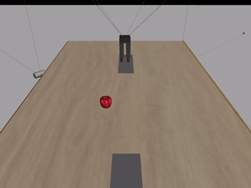 | 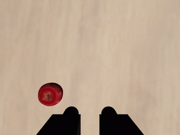 |

The synchronized pair above corresponds to [`overview_video_2.mp4`](assets/research/grpo_validation/overview_video_2.mp4) and [`ee_camera_video_2.mp4`](assets/research/grpo_validation/ee_camera_video_2.mp4), and provides overview plus wrist-camera evidence that the RL-only policy can follow language-conditioned motion objectives.

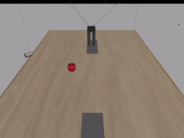

The clip above corresponds to [`overview_video_1.mp4`](assets/research/grpo_validation/overview_video_1.mp4) and shows a shortcut behavior similar to the "pushcuts" discussed in [SimpleVLA-RL: Scaling VLA Training via Reinforcement Learning](https://arxiv.org/abs/2509.09674): the policy learns an easier reward-increasing behavior that is not exactly the behavior intended by the instruction.

This qualitative split is important for interpreting early RL results. The videos show that the method is already working behaviorally, while also exposing the reward-design and stability problems that still separate partial competence from robust task completion.

### Object-Conditioned Qualitative Samples

Even with a strict `9.7%` success rate on `move to <object>`, the validation rollouts frequently contained visually correct approach behavior across the full object set:

| Bowl | Plate | Baseball | Mug |
| --- | --- | --- | --- |
| 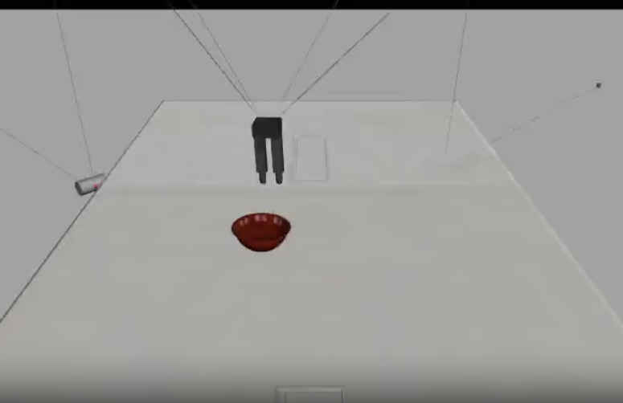 | 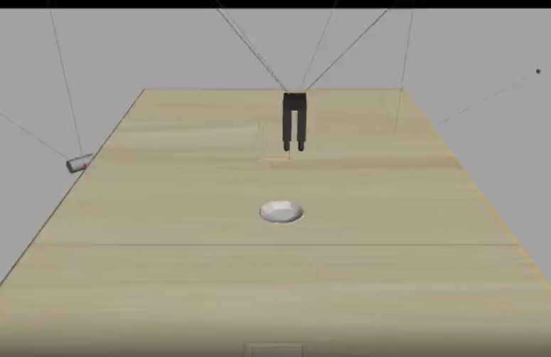 | 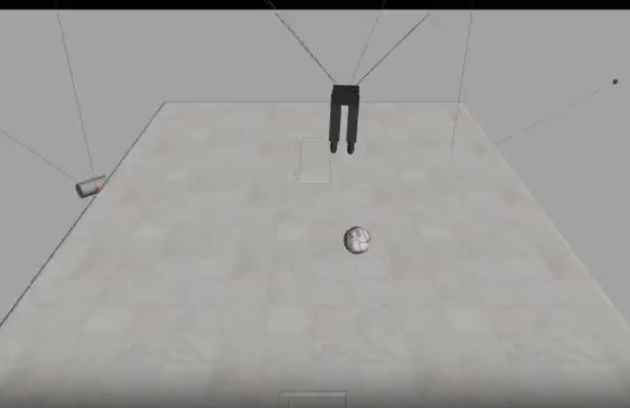 | 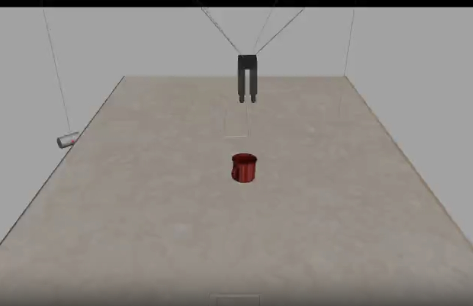 |

| Cup | Peach | Pear | Apple |
| --- | --- | --- | --- |
| 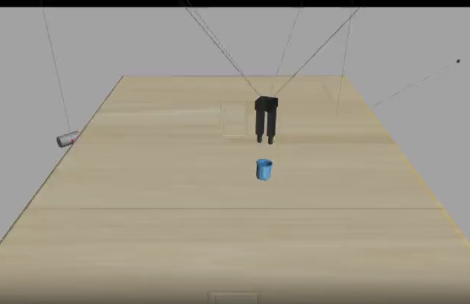 | 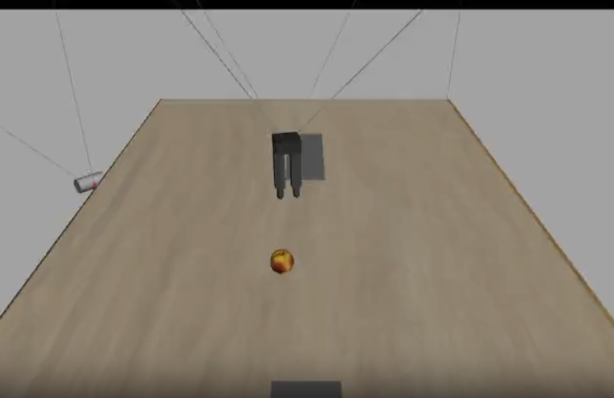 | 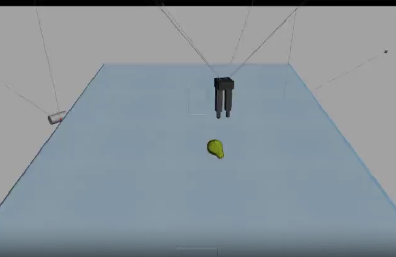 | 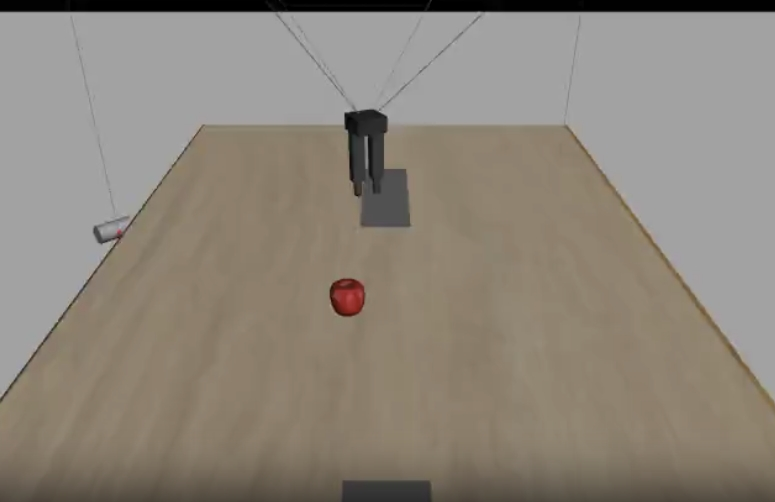 |

Taken together, the current evidence suggests a concrete research direction: bootstrap instruction following with RL alone, use qualitative rollouts to detect shortcut behaviors early, and treat stability near the target as the next major bottleneck rather than evidence that the core methodology does not work.

---

`rl_vla_bootstrapping` is an embodiment-first orchestration framework for building language-conditioned visuomotor training stacks around a new robot without starting from demonstrations.

For remote CDPR PPO runs on OpenVLA-OFT, the recommended config in this repo is `configs/examples/cdpr_openvla_bootstrap_fast.yaml`. It assumes the remote server keeps OpenVLA-OFT at `/root/repo/openvla-oft`:

```text
/root/repo/
├── RL_VLA_Bootstrapping/
└── openvla-oft/
```

The repo is intentionally centered on separable layers instead of a single PPO or OpenVLA implementation:

- Embodiment specification: MuJoCo XML, controller entrypoint, joint/action metadata, limits, gripper semantics, and a shared action codec.
- Task specification: language instructions, object sets, goal relations, success predicates, and optional dense reward hooks.
- Simulation specification: scene builders, object assets, randomization, cameras, and preview helpers.
- Policy specification: external VLA backbones such as OpenVLA-OFT plus action-head/action-codec metadata.
- Training and evaluation orchestration: zero-demo RL first, SFT refinement later, benchmark hooks for RoboTwin 2.0 / ManiTask-style suites.

The framework does not vendor the VLA model itself. Instead, it expects an external OpenVLA-OFT repo path and generates a consistent training plan around it.

## Layout

- `rl_vla_bootstrapping/core`: config loading, import helpers, shared specs.
- `rl_vla_bootstrapping/policy`: action codec and policy connectors.
- `rl_vla_bootstrapping/pipeline`: stage planning and execution.
- `rl_vla_bootstrapping/cli`: entrypoints for training and preview.
- `robots`: embodiment bundles; the CDPR example now lives under `robots/cdpr/`.
- `assets`: staged YCB/LIBERO asset bundles.
- `benchmarks`: staged RoboTwin 2.0 / ManiTask repos and adapters.
- `environments`: remote conda environment definitions.
- `configs/examples`: example configs, including a CDPR + OpenVLA-OFT bootstrap config.
- `scripts`: thin shell wrappers for preview and training.

## Quick Start

1. Create the remote environment:

```bash
conda env update -n openvla-oft -f environments/openvla-oft-remote.yaml --prune
```

Or do the full remote bootstrap in one step:

```bash
./scripts/setup_remote.sh configs/examples/cdpr_openvla_bootstrap_fast.yaml
```

2. Stage assets into repo-local paths:

```bash
python -m rl_vla_bootstrapping.cli.assets \
  --config configs/examples/cdpr_openvla_bootstrap_fast.yaml \
  --stage
```

3. Validate the runtime and robot setup:

```bash
./scripts/doctor_bootstrap.sh configs/examples/cdpr_openvla_bootstrap_fast.yaml
```

4. Run a preview:

```bash
./scripts/preview_bootstrap.sh configs/examples/cdpr_openvla_bootstrap_fast.yaml
```

5. Plan the full pipeline:

```bash
python -m rl_vla_bootstrapping.cli.train --config configs/examples/cdpr_openvla_bootstrap_fast.yaml
```

6. Execute the selected stages:

```bash
./scripts/train_bootstrap.sh configs/examples/cdpr_openvla_bootstrap_fast.yaml
```

TensorBoard for the fast CDPR preset writes under `runs/<run_name>/rl/tensorboard`. The external OpenVLA/OFT PPO trainer creates the main writer on rank 0, prints the resolved log directory at startup, logs update-level training scalars every PPO update because `tensorboard_every_updates: 1`, and the fast preset requests validation TensorBoard points every 10 updates. The fast wrapper also adds `rollout_step/*` summaries every 100 rank-0 `global_step`s via `tensorboard_rollout_every_global_steps`, which is useful when one PPO update spans thousands of rollout steps.

For a self-contained CDPR safe-RL baseline inside this repo, use `rl_vla_bootstrapping/policy/blac_finetune_cdpr.py`. It implements a Barrier-Lyapunov Actor-Critic inspired by Zhao et al. ([paper](https://arxiv.org/pdf/2304.04066)) on top of the repo’s vector-state CDPR env and also exposes compatible off-policy baselines through `--algorithm blac|bac|sac|td3|redq`. The script accepts the same CDPR/env arguments that the pipeline already injects, so a config can swap from PPO by changing `training.rl.script_path` and `training.rl.algorithm`.

If you want to extend the OpenVLA path directly in-tree, the reusable feature-extraction and actor/critic wrapper now lives in `rl_vla_bootstrapping/policy/openvla_actor_critic.py`. That module keeps the OpenVLA prompt formatting, multimodal token preparation, action-token extraction, and twin-critic scaffolding in this repo instead of only inside ad hoc scripts.

The first trainer wired on top of that stack is `rl_vla_bootstrapping/policy/openvla_blac_finetune_cdpr.py`. It runs chunked OpenVLA action-head finetuning directly against `CDPRVisionLanguageEnv`, stores image-conditioned replay, and applies BLAC-style workspace barrier / Lyapunov penalties using the repo-local safety machinery.

7. Run a trained OpenVLA/OFT CDPR policy with the same control scales used in RL:

```bash
python -m rl_vla_bootstrapping.cli.run_cdpr_policy \
  --config configs/examples/cdpr_openvla_bootstrap_fast.yaml \
  --adapter-path /path/to/vla_cdpr_adapter \
  --action-head-path /path/to/action_head_cdpr.pt \
  --target-object ycb_apple \
  --distractor ycb_banana \
  --distractor ycb_orange
```

8. Diagnose whether scripted OpenVLA-style 8-action chunks actually move the CDPR controller:

```bash
python -m rl_vla_bootstrapping.cli.diagnose_cdpr_policy \
  --config configs/examples/cdpr_openvla_bootstrap_fast.yaml \
  --target-object ycb_apple \
  --hold-steps 10 \
  --axis-magnitude 0.25 \
  --random-demos 1
```

## Runtime Notes

Preview and training stages use the dependencies required by the vendored CDPR example bundle under `robots/cdpr/` plus the external OpenVLA/OFT repo. For the current stack that means MuJoCo, EGL-capable rendering on Linux, `opencv-python`, and the OpenVLA/OFT training dependencies from the included environment file.

The CDPR example config now separates the instruction target pool from distractors via `task.metadata`. `task.target_objects` should contain only valid instruction targets, while `task.metadata.target_object_pool` / `task.metadata.distractor_object_pool` define the full scene object sampling pool. The repo-local runner and the RL env both use the same normalized action interpretation: XYZ deltas scaled by `action_step_xyz`, yaw scaled by `action_step_yaw`, gripper thresholded at the configured open/close cutoffs, and one policy action expanded into `1 + hold_steps` MuJoCo steps.

## Assets And Benchmarks

The repo intentionally does not commit large YCB/LIBERO assets or full RoboTwin 2.0 / ManiTask repos.

- YCB and LIBERO are staged under `assets/externals/`.
- RoboTwin 2.0 and ManiTask are staged under `benchmarks/externals/`.
- GitHub stores only the framework, configs, and asset bundle definitions; large asset directories are linked or copied into the local checkout with `rl_vla_bootstrapping.cli.assets`.
- The CDPR example config already includes bundle definitions and disabled benchmark stages.
- Benchmark stages use local wrappers in `rl_vla_bootstrapping/evaluation/` so the evaluation layer is visible in this repo even though the benchmark repos stay external.

## Robot Integration Contract

For a new robot, the smallest useful setup is:

- a MuJoCo XML file,
- a Python controller class,
- a config entry declaring action keys, scaling, and controller method names,
- optionally a scene-builder function and reward/success functions.

The framework normalizes RL and SFT around a shared `ActionCodec`. RL policies operate in the common normalized action space; SFT can quantize exactly the same normalized space later, so the refinement stage remains consistent with the RL stage.
