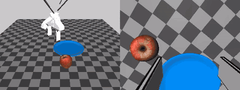
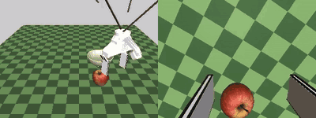
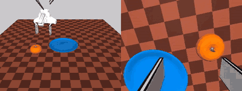
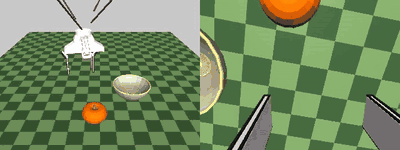
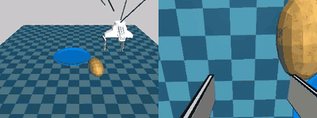
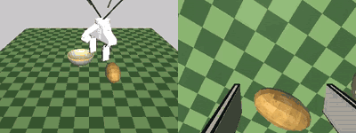
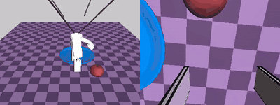
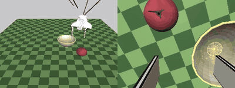
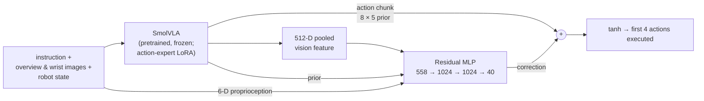
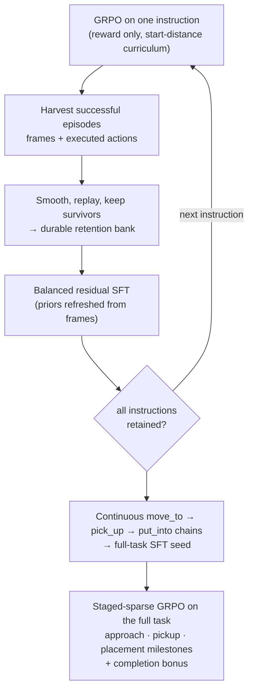

# RL-VLA Bootstrapping

**Teaching a pretrained vision-language-action model to manipulate objects on a
new robot without a human-collected dataset.**

A pretrained [SmolVLA](https://huggingface.co/lerobot/smolvla_base) model is
placed on a robot it has never seen: a simulated 5-DoF cable-driven parallel
robot (CDPR). It learns the robot's manipulation skills from reward alone. It
then learns further from trajectories it generated itself, and finally learns
the complete *"put the object into the plate/bowl"* task from an empty gripper.
No human demonstrations are recorded for this robot at any stage.

📄 Project page: <https://damurka5.github.io/RL_VLA_Bootstrapping/> · 📊 Full record: [`CDPR_CONSOLIDATED_PROGRESS_REPORT.md`](CDPR_CONSOLIDATED_PROGRESS_REPORT.md)

<table>
  <tr>
    <th>put … into plate</th>
    <th>put … into bowl</th>
  </tr>
  <tr>
    <td></td>
    <td></td>
  </tr>
  <tr>
    <td></td>
    <td></td>
  </tr>
  <tr>
    <td></td>
    <td></td>
  </tr>
  <tr>
    <td></td>
    <td></td>
  </tr>
</table>

<sub>Unassisted episodes on held-out scenes. The gripper starts empty, receives
one instruction, and must approach, grasp, lift, carry and release the object
inside the receptacle. Left half: overview camera; right half: wrist camera.
The clips are strict successes of checkpoint `step_28309431` (2026-09-17,
22.3% strict). The current best checkpoint scores about twice that; see
[Results](#results). Original MP4s and per-episode records are in
[`docs/media/put_into/`](docs/media/put_into/).</sub>

---

## Contents

- [The idea](#the-idea)
- [Robot and tasks](#robot-and-tasks)
- [Method](#method)
- [Results](#results)
- [What is not solved yet](#what-is-not-solved-yet)
- [Repository layout](#repository-layout)
- [Getting started](#getting-started)
- [Documentation](#documentation)

## The idea

VLA models are usually adapted to a new robot by collecting hundreds of human
teleoperation demonstrations and fine-tuning on them. This project asks whether
the robot can produce its own training data instead:

1. **Acquire skills with RL.** Keep the pretrained VLA as a frozen *action
   prior*. Learn a small *residual* correction on top of it with GRPO, from
   task reward only.
2. **Keep them with self-generated data.** Record the policy's own successful
   episodes into a durable bank. Balanced supervised fine-tuning on that bank
   brings back skills that later RL runs erode.
3. **Compose them with staged sparse rewards.** Train the full pick-and-place
   task from an empty gripper with three ordered binary milestones (approach,
   pick up, place), each with its own group-relative advantage.

> **What "without a human dataset" means here.** No teleoperation or other
> human demonstrations were collected for this robot. It does *not* mean the
> pretrained SmolVLA never saw human robot data; it did, during its
> pretraining. Rewards, success predicates, the simulator and the controller
> are also human-designed. Some intermediate datasets contain actions from
> scripted controllers: a ground-truth oracle seeded the Phase 6 composition
> bank, and alignment/yaw controllers bridge the three-stage chains. Removing
> them from the lineage of the final policy is open work. See
> [`docs/research/CDPR_RESEARCH_THEORY.md`](docs/research/CDPR_RESEARCH_THEORY.md) §1.

## Robot and tasks

| | |
|---|---|
| Embodiment | Simulated cable-driven parallel robot with a parallel gripper, MuJoCo model in [`robots/cdpr/`](robots/cdpr/) |
| Action | `[x, y, z, yaw, gripper] ∈ [-1, 1]⁵`, world-frame end-effector deltas, executed in chunks |
| Observation | Overview camera + wrist camera + language instruction + 6-D proprioception |
| Objects | RoboCasa apple, orange, potato, tomato; a plate and a bowl as receptacles |
| Instructions | `move to <object>`, `pick up <object>`, `put <object> into plate`, `put <object> into bowl` |
| Simulator | MuJoCo Warp through MJ-Lab: 512 parallel worlds per GPU, 2× NVIDIA A40 |

## Method

### Policy


```mermaid
flowchart LR
  I["instruction +<br/>overview & wrist images +<br/>robot state"] --> V["SmolVLA<br/>(pretrained, frozen;<br/>action-expert LoRA)"]
  V -->|"action chunk<br/>8 × 5 prior"| S(("+"))
  V --> F["512-D pooled<br/>vision feature"]
  F --> R["Residual MLP<br/>558 → 1024 → 1024 → 40"]
  I -->|6-D proprioception| R
  V -->|prior| R
  R -->|correction| S
  S --> T["tanh → first 4 actions executed"]
```

The final action is `tanh(prior + residual)`. In the current full-task RL only
the residual (≈1.7M parameters) is updated. The action-expert LoRA is trained
in the SFT stage; earlier phases also trained it with RL. A policy step emits an
8-step chunk and re-plans every 4 steps.

### Training pipeline


```mermaid
flowchart TD
  A["GRPO on one instruction<br/>(reward only, start-distance curriculum)"] --> B["Harvest successful episodes<br/>frames + executed actions"]
  B --> C["Smooth, replay, keep survivors<br/>→ durable retention bank"]
  C --> D["Balanced residual SFT<br/>(priors refreshed from frames)"]
  D --> E{"all instructions<br/>retained?"}
  E -->|next instruction| A
  E --> G["Continuous move_to → pick_up → put_into chains<br/>→ full-task SFT seed"]
  G --> H["Staged-sparse GRPO on the full task<br/>approach · pickup · placement milestones<br/>+ completion bonus"]
```

| Phase | Dates (2026) | What was learned |
|---|---|---|
| 0 | Jul – Aug | `move_to_object` by RL only |
| 1 | Aug | `pick_up`; showed that the frozen encoder localizes to only 3–5 cm |
| 2 | Aug 13 | Placement from a held object by RL only, starting at 0% |
| 3 | Aug 17 | Self-imitation toolchain: record → smooth → replay → SFT |
| 4–5 | Aug 21 – 31 | Retention bank; one adapter for all four instructions |
| 6–7 | Aug 30 – Sep 9 | Composed pick-and-place; one sparse reward for all instructions |
| 8 | Sep 10 – 28 | Three-stage chains → staged-sparse GRPO on the full empty-start task |

## Results

### Full task: empty gripper → object in the receptacle

Standalone evaluator: 256 distinct held-out scenes, one instruction from the
first action, no assistance. *Strict* success means the episode began empty and
outside the goal, then grasped, lifted, carried without a slip, and released
intentionally inside the receptacle.

| Checkpoint | Training | Strict success | Native placement |
|---|---|---:|---:|
| SFT seed on self-generated chains | — | 5/128 = 3.9% | — |
| `step_28309431` | 28.3M steps staged-sparse GRPO | 57/256 = 22.3% | 73/256 = 28.5% |
| `step_52791642` | + equal stage mass, completion bonus (~53M) | 91/256 = 35.6% | 111/256 = 43.4% |
| **`step_56072006`** (current best) | + grasp-preservation continuation (~56M) | **107/256 = 41.8%** | **127/256 = 49.6%** |

`step_56072006` beat `step_52791642` on the same scenes, 107 to 85 (exact
McNemar p = 0.012). Pooled over two evaluations each, the two checkpoints score
39.1% and 34.4%. A single evaluation of one checkpoint flips 25–29% of scene
verdicts between runs, so differences below about 5 points need pooled repeats.

### Individual skills (each on its own protocol)

| Result | Value |
|---|---|
| `move_to_object`, RL only, 2 cm tolerance | **63.0%** (645/1024) |
| Placement from a held object, RL only, from 0% | plate **71%**, bowl **32%** after 15M steps |
| One adapter, four instructions (Cycle 3) | move-to 47.8%, pick-up 11.9%, plate 73.8%, bowl 53.5% |
| Retention SFT on a self-generated bank (Cycle 1) | rebuilt forgotten `move_to` 3.9× (8.0% → 31.1%) while both placement tasks also improved |

### Main findings

1. **RL alone grounds a pretrained VLA on a new embodiment.** A frozen prior
   plus a residual learned reaching and placement from reward only.
2. **Task tolerance decides whether the VLA's vision is enough.** Its 3–5 cm
   localization is too coarse for a ~2 cm grasp and sufficient for 5.7–9.1 cm
   placement radii.
3. **Self-generated data prevents forgetting, and dataset size is the lever.**
   A 4.3× larger balanced slice broke the retention ceiling where more epochs
   did not.
4. **RL composes, SFT can un-compose.** Retention SFT removed about 72% of a
   composed pick-and-place skill that RL had built. The two halves of the loop
   have to be reconciled.
5. **Staged sparse rewards train the complete task once each milestone is
   reachable.** On the same standalone evaluator, strict full-task success
   rose from 3.9% for the SFT seed to 41.8%.
6. **Measure before steering.** Evaluation noise comes mostly from closed-loop
   physics chaos, not from the VLA's sampling. Seven SFT fits on the policy's
   own successes never beat their initializer.

The full evidence, protocols, and negative results are in the
[consolidated report](CDPR_CONSOLIDATED_PROGRESS_REPORT.md) (§1 summary,
§12 conclusions, §14 dated ledger).

## What is not solved yet

- **Holding the object through the carry.** Carry slips and post-lift wrong
  placements are the dominant failure, and the grasp rate erodes under
  continued RL.
- **Retention and composition together.** RL on the composed task and SFT on
  the retention bank still pull against each other.
- **Localization resolution.** The frozen encoder's pooled feature feeds the
  residual without gradient.
- **Scope.** One simulated embodiment. A port to a WidowX-200 arm keeps the
  action contract, but batched training on it is not wired yet
  ([report](docs/reports/side_tracks/WIDOWX200_MIGRATION_REPORT.md)).

## Repository layout

```text
CDPR_CONSOLIDATED_PROGRESS_REPORT.md   canonical results record (start here)
configs/examples/                      run configs; current: cdpr_smolvla_three_stage_put_into.yaml
rl_vla_bootstrapping/
  policy/        SmolVLA runtime, residual policy, GRPO trainer on MJWarp,
                 rank-local collector, staged demonstrations, LoRA
  simulation/    MJ-Lab/MJWarp and CPU MuJoCo backends, batched tasks,
                 full-task outcome, scenes and object catalog
  lchol/         reverse-frontier curriculum and hindsight tools (earlier method)
  cli/           evaluation, plotting and policy-running entry points
robots/          embodiments: cdpr/ (MuJoCo model, controller) and widowx200/
tools/audit/     self-imitation, harvesting, SFT, evaluators and forensic probes
tools/train/     demonstration-start GRPO helpers
scripts/         remote launchers for training, collection, SFT and evaluation
tests/           unit and regression tests
docs/            project page, reports, research draft, simulator docs, media
```

`rl_vla_bootstrapping/policy/` still contains the earlier OpenVLA-OFT, Octo,
PPO and BLAC trainers. The current method only uses the SmolVLA/MJWarp path
(`smolvla_grpo_mjwarp_cdpr.py`, `mjwarp_rank_local_collector.py`,
`smolvla_cdpr.py`).

## Getting started

Training runs on a Linux host with two NVIDIA A40s (CUDA 12.8). Full
instructions are in [`docs/cdpr_mjlab_remote.md`](docs/cdpr_mjlab_remote.md).

Set up the environment (Conda `cdpr-mjlab`, RoboCasa assets, strict GPU preflight):

```bash
REPO_ROOT="$PWD" ENV_NAME=cdpr-mjlab bash scripts/setup_cdpr_mjlab_remote.sh
```

Build the full-task scene manifest with disjoint splits:

```bash
conda run -n cdpr-mjlab python tools/audit/build_cdpr_composition_scenes.py --config configs/examples/cdpr_smolvla_three_stage_put_into.yaml --count 8192 --seed 20260910 --output runs/three_stage/scenes_8192.json
```

Train staged-sparse GRPO on the full task, from an initializer or resuming a run:

```bash
WARMSTART_CHECKPOINT=/path/to/smolvla_grpo_adapter.pt MAX_TRAIN_STEPS=10000000 MAX_UPDATES=0 bash scripts/train_cdpr_three_stage_sparse_grpo_remote.sh
```

Evaluate a checkpoint on held-out scenes and record episode videos:

```bash
CHECKPOINT=runs/<run>/rl/<step> bash scripts/evaluate_cdpr_three_stage_put_into_videos_remote.sh
```

Run the unit tests locally. Most of them run on CPU:

```bash
PYTHONPATH=. python3 -m unittest discover -s tests -p 'test_*.py'
```

## Documentation

| Document | Contents |
|---|---|
| [`CDPR_CONSOLIDATED_PROGRESS_REPORT.md`](CDPR_CONSOLIDATED_PROGRESS_REPORT.md) | Headline results, method, exclusions, and the dated experiment ledger |
| [`docs/reports/`](docs/reports/README.md) | Phase reports, superseded plans, side tracks and history, catalogued |
| [`docs/research/CDPR_RESEARCH_THEORY.md`](docs/research/CDPR_RESEARCH_THEORY.md) | Mathematical draft of the dissertation framing |
| [`docs/cdpr_mjlab_architecture.md`](docs/cdpr_mjlab_architecture.md) | Batched MJWarp simulator architecture |
| [`docs/reports/history/OPENVLA_OCTO_ERA_SUMMARY.md`](docs/reports/history/OPENVLA_OCTO_ERA_SUMMARY.md) | The project before SmolVLA: OpenVLA-OFT PPO → GRPO, LC-HOL, Octo |
