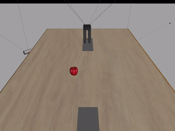
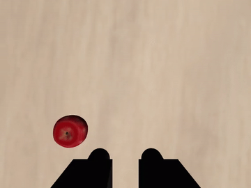

# Before SmolVLA: the OpenVLA-OFT and Octo era (March – July 2026)

This file merges the reports written before the project moved to a frozen
SmolVLA prior with a residual policy on batched MJWarp. None of it is the
current method. It is kept because it explains where the current design came
from and which ideas were already tried.

The full original texts are in [`legacy/`](legacy/) and in git history (all
of them are in commit `9339dd9`):

| Original report | Date | What it was |
|---|---|---|
| `PPO_OPENVLA_CDPR_REPORT.md` | 2026-04-06 | PPO formulation for OpenVLA-OFT on CDPR, parameter count |
| `CURRENT_CDPR_PPO_GRPO_PIPELINE_REPORT.md` | 2026-04-09 | Reconstruction of the PPO → GRPO pipeline, what "one update" means |
| Old `README.md` research update | 2026-04-20 | PPO 175 h → GRPO +170 h results and validation videos |
| `CDPR_LC_HOL_IMPLEMENTATION.md` | 2026-05-04 | LC-HOL option/hindsight layer for complex instructions |
| `CDPR_REVERSE_FRONTIER_LCHOL_ANALYSIS_REPORT.md` | 2026-05-26 | Review of the reverse-frontier curriculum + LC-HOL implementation |
| `CDPR_OPENVLA_FULL_PIPELINE_REPORT.md` | 2026-05-29 | End-to-end shape walk-through of the OpenVLA complex-task pipeline |
| `CDPR_CHECKPOINT_0048000_EVALUATION_REMEDIATION.md` | 2026-06-21 | Evaluation of the first sparse complex-task checkpoint |
| `CDPR_RECOVERY_RUNBOOK.md` | 2026-06-22 | Decision to restart from the last dense checkpoint |
| `CDPR_COMPLEX_CHECKPOINT_EVALUATION.md` | 2026-07-01 | Remote commands for comparing plateau checkpoints |
| `CDPR_OCTO_SMALL_REMOTE_RUNBOOK.md` | 2026-07-02 | Octo-Small residual/readout alternative |
| `SMOLVLA_COMPLEX_GRPO_EXPERIMENTS.md` | 2026-07-13 | Reverse Frontier vs LC-HOL++ on the first SmolVLA residual |
| `COLLABORATOR_SETUP.md` | 2026-03-18 | Setup notes for the OpenVLA-OFT layout |

---

## 1. OpenVLA-OFT with PPO, then GRPO (March – April 2026)

**Setup.** OpenVLA-7B (DINOv2 + SigLIP vision, LLaMA-2 backbone) with the OFT
continuous action head, emitting an 8-step chunk of 5-D CDPR actions
`[x, y, z, yaw, gripper] ∈ [-1, 1]`. Exploration was a squashed Gaussian:
`a = tanh(u + σ·ε)` with a learned `log_std`. Two cameras (overview and wrist)
plus the instruction were the only inputs. No demonstration dataset was used.

**PPO.** A value head with GAE. The trainable set was large: action head
117.5M, value head 83.9M, and roughly 108M LoRA parameters, about 309M in total.

**GRPO.** The critic was dropped. Candidate action chunks were sampled from the
same simulator snapshot, and within-group reward differences became the
advantage under a PPO-style clipped objective. The action-saturation rate fell
from about 0.25 at the end of PPO to about 0.15 after 10 GRPO updates.

**Result (2026-04-20).** 175 h of PPO and then 170 h of GRPO on 2× A40, 345 h
in total:

| Instruction | PPO after 175 h | PPO → GRPO after +170 h |
|---|---:|---:|
| `move left` | 17% | 52% |
| `move right` | 43% | 52% |
| `move forward` | 62% | 62% |
| `move backward` | 15% | 48% |
| `move to <object>` | — | 9.7% (39/400) |

RL alone produced language-conditioned motion on a new embodiment. The
object-conditioned task was weak: the end effector often approached the right
object and then drifted away. Some videos showed a reward "shortcut" of the kind
the SimpleVLA-RL paper calls a pushcut. Those videos are still in
[`assets/research/grpo_validation/`](../../../assets/research/grpo_validation/).

| Overview camera | Wrist camera |
|---|---|
|  |  |

## 2. Complex instructions: LC-HOL and the reverse-frontier curriculum (May – June 2026)

**Goal.** Start from the move-to-object checkpoint and extend it to
manipulation and relation tasks: `grab`, `pick up`, `push left/right`,
`put into plate`, `move A left/right of B`, `move A between B and C`.

**What was built.**

- Sparse binary success predicates for every option.
- Reverse-shell resets that start episodes close to success and move outward.
- Frontier/rehearsal sampling with validation-probe promotion and demotion.
- LC-HOL-compatible hindsight records in a per-option replay buffer, trained
  with an auxiliary behaviour-cloning loss. Relabelled records never entered
  the GRPO advantage batch.

**What the review found (2026-05-26).** The curriculum was implemented as
designed. The hindsight part was HER-inspired, not full HER. The main risk was
**sparse signal starvation**: with `lchol_group_score: env_reward`, many GRPO
groups had all-zero reward and so produced no advantage. That problem came back
later in the SmolVLA campaign as "zero-advantage groups" and "dynamic sampling".

**What the evaluation showed (2026-06-21, `step_0048000`).** 365/2820 = 12.9%
overall, but the aggregate hid the failure. On the easy reverse shells
`move_to_object` scored 92%, 56% and 21%. On the normal scene it scored 3.3%, and
canonical `move_to_object` scored **0/100**. The gripper tasks were at 0%. The
recovery runbook dropped the sparse checkpoint and restarted from the last
dense checkpoint, `step_0216000`. It also gated sparse training on action-primitive
acceptance tests. At that point the simple-task baseline to beat was 16.7%
overall and 9% `move_to_object`.

## 3. Alternatives tried in early July 2026

- **Octo-Small** (`hf://rail-berkeley/octo-small-1.5`), frozen, with a small
  Torch residual/readout adapter and critics. It was a runbook experiment with
  the OpenVLA baseline above as its bar. It did not become the main line.
- **SmolVLA, first version.** A TD3-trained residual actor on a SmolVLA prior,
  followed by a GRPO comparison of Reverse Frontier against LC-HOL++ on seven
  instruction types with strictly binary rewards (2026-07-13). The comparison
  rule was the worst-instruction full-task success, not the mean.

## 4. What carried over into the current method

| Early idea | What happened to it |
|---|---|
| RL without a demonstration dataset | Kept. It is the central claim of the project |
| Two cameras + instruction, 5-D chunked actions in `[-1, 1]` | Kept as the action/observation contract |
| GRPO instead of PPO with a critic | Kept. The actor–critic proposal of 2026-09-08 was rejected again |
| Whole-VLA fine-tuning (OpenVLA LoRA + heads, ~300M params) | Replaced by a **frozen SmolVLA prior + trainable residual MLP**, with LoRA only on the action expert |
| One CPU MuJoCo environment per rank | Replaced by **rank-local batched MJWarp** (July 18 onward) |
| Reverse-shell / near-success starts | Became the start-distance curriculum (`cap`) and, later, demonstration-start GRPO |
| LC-HOL hindsight relabelling | Measured dead for caught-start placement (Phase 3). The legacy code is not on the MJWarp path |
| Sparse binary rewards | Came back as the Phase 7 single sparse reward and the three-milestone staged-sparse reward |
| All-zero GRPO groups | Became the degenerate-group filter and dynamic sampling |
