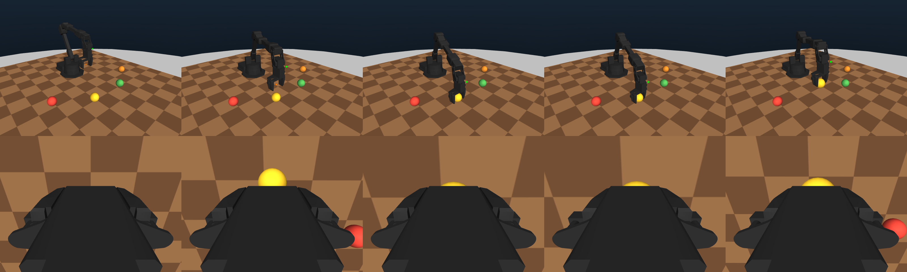

# Interbotix WidowX-200

A 5-DoF serial arm bundle, built so that everything above the controller —
the five-channel normalized action, the reward hooks, the success predicates,
the reverse-frontier curriculum, the GRPO collector, the SmolVLA residual —
runs on it unchanged from the CDPR.

```text
widowx200_mujoco/
  wx200.xml               robot: URDF-exact kinematics, visual meshes, primitive collision
  wx200_scene.xml         desk, lights, overview camera; includes wx200.xml
  meshes/                 upstream Interbotix STLs (BSD-3, Trossen) + LICENSE
  kinematics.py           closed-form FK and top-down IK, NumPy and Torch
  controller.py           host controller + the shared action-integration algebra
  batched_controller.py   the MJWarp-side controller, pure tensor ops
  workspace.py            reach envelope, scene layout, object lattice, mount
widowx200_dataset/        scenes, tasks, reward wiring (not yet populated)
```

Tests: `tests/test_widowx200_embodiment.py` (34, all passing).



Overview and wrist cameras through a scripted grasp, driven only through the
normalized five-channel action. The object lifts 77 mm.

## The one design decision everything else follows from

The arm keeps the CDPR's action space exactly: `[x, y, z, yaw, gripper]` in
`[-1, 1]`, where XYZ are **world-frame end-effector deltas**. It can, because
the controller solves inverse kinematics every step.

That contract is not a CDPR implementation detail — it is the interface the
policy learned over hundreds of GPU-hours across phases 1 to 5. Preserving it
means the reward functions, the shaping windows, the success radii, the
curriculum shells, the action codec, and the residual head all transfer
without edits, and a CDPR checkpoint is at least a candidate warm start rather
than automatically worthless.

The arm has five joints and the task has six degrees of freedom, so one has to
go. Pitch is pinned to straight down, which makes the remaining map
`(x, y, z, yaw) -> (q1..q5)` square and closed-form: no iteration, no Jacobian,
no null space, no per-world solver divergence. It is also how these arms are
actually driven — Interbotix's own `set_ee_pose_components` and the BridgeData
WidowX stack both command Cartesian poses with a fixed approach.

**The cost, stated plainly:** no side or angled approaches. A task that needs
one requires promoting pitch to a sixth action channel, which changes the
action space and invalidates existing checkpoints. `TOP_DOWN_PITCH` is a
parameter rather than a baked-in constant precisely so that stays a config
change instead of a rewrite.

## What is different from the CDPR, and why

| | CDPR | WidowX-200 |
|---|---|---|
| Action | `[x,y,z,yaw,gripper]` | **identical** |
| Controller | target → cable lengths → 4 sliders | target → 5 joint angles (closed-form IK) |
| Startup calibration | finite-difference 4 tendon Jacobians | none — resolve names to indices |
| Control period | 14 ms (`hold_steps=6`) | **50 ms** (`hold_steps=24`) |
| Target integration | from the measured pose | **from the previous target, leashed** |
| Reachable set | box, ±0.28 m | **annular sector**, r 0.16–0.34, ±50° |
| Gripper span | 35–95 mm | **8–52 mm** |
| Tracked body | `ee_base`, 7.5 mm above the pads | `ee_base`, **at** the pads |

Four of those are load-bearing.

**Control period.** 15 mm in 14 ms is ~1.07 m/s at the tool, past this arm's
joint-rate limit. 50 ms is both achievable and the rate a real WidowX runs at.

**Target integration.** The CDPR builds each target from the measured pose, which
is exact for a platform that tracks a full step inside one window. Measured
here: this arm recovers 12% of a 15 mm step at 14 ms and 37% at 50 ms, so
`ee + delta` silently *attenuates* every action, and the effective step size
becomes a function of how fast the arm happens to be moving. Integrating the
target keeps the commanded step exact; a leash keeps the lag from winding up.
See `WidowX200ControlSpec.target_leash` for the measured trade curve.

**Reachable set.** A serial arm's top-down workspace is an annulus around its own
base, not a box. The CDPR's ±0.205 m object square has corners 0.49 m from any
sensible mount, against a top-down reach of about 0.35 m — reusing it would
spawn targets the arm provably cannot touch and charge the policy for failing
to reach them. `workspace.py` derives the sector instead of assuming it, and
never uses the datasheet's "550 mm reach", which is the fully-extended figure
and 15 cm optimistic once the wrist folds to vertical.

**Gripper span.** This is the constraint with the widest blast radius: it decides
which objects the catalog may contain at all. See below.

## The object catalog does not fit this gripper

Measured on the compiled model: the pads span 8 mm closed and 52 mm open, and
the band that actually grasps and lifts is **30–56 mm**. Against the current
RoboCasa catalog's minimum grasp width:

| object | width | graspable |
|---|---:|:---:|
| mug (handle) | 12 mm | no — too thin |
| bowl (rim) | 10 mm | no — too thin |
| carrot | 24 mm | no |
| banana | 28 mm | marginal |
| plate | 182 mm | no (receptacle) |
| tomato, orange, potato | 58 mm | no |
| apple | 69 mm | no |
| bell pepper | 74 mm | no |

Nothing in the catalog is comfortably graspable. The fix is to rescale the
graspable objects to a 34–50 mm minor width rather than to drop them — a 7 cm
apple is out of scale for a 200 g-payload arm in the first place, so this is
the physically correct correction, not a workaround. Rescaling also invalidates
each variant's `rest_height`, `inertia`, and `fitted_gripper_opening`; the last
of those is embodiment-specific and has to be re-measured on this gripper
regardless (its docstring in `cdpr_object_catalog` says exactly why deriving it
from geometry does not work).

## Adding this robot to a scene

```python
from robots.widowx200.widowx200_mujoco import workspace as W
from robots.widowx200.widowx200_mujoco.controller import (
    WidowX200ControlSpec, WidowX200MountPose, WidowX200TaskSpaceController)

layout = W.DEFAULT_LAYOUT
model = mujoco.MjModel.from_xml_path("robots/widowx200/widowx200_mujoco/wx200_scene.xml")
W.mount_widowx200(model, layout)          # places `wx200_mount`; no recompile

controller = WidowX200TaskSpaceController(
    model, data,
    spec=WidowX200ControlSpec(
        mount=WidowX200MountPose(layout.base_position, layout.base_yaw),
        workspace_x=layout.workspace_x,
        workspace_y=layout.workspace_y,
        workspace_z=layout.workspace_z,
        min_reach_radius=layout.min_reach_radius,
    ),
)
controller.reset_to_pose([0.0, 0.0, 0.26], yaw=0.0, gripper=1.0)
controller.apply_normalized_action([0.0, 0.0, -1.0, 0.0, 0.0])
```

The mount pose lives in `workspace.DEFAULT_LAYOUT` and nowhere else. The scene
XML deliberately does not carry a second copy: the controller needs the pose to
convert world targets into the base frame, and two copies that drift apart
produce an IK solution computed in the wrong frame — which raises nothing and
simply never reaches anything.

## Measured numbers

All from `tests/test_widowx200_embodiment.py` against the compiled model:

- IK vs MuJoCo's own forward kinematics: **2e-15 m**, over 465 random reachable
  poses. The approach axis is `(0, 0, -1)` and the yaw convention matches the
  CDPR's (`yaw = 0` puts the finger axis on world `+x`) to the same precision.
- Steady-state hold error: **1.4 mm**.
- Settling error after a move: **1.6 mm**.
- Top-down reach: **0.381 m** at the grasp floor, **0.362 m** while carrying a
  lifted object at z = 0.24, nothing above z = 0.41.
- Object lattice: 6 cells, **0.180 m** minimum separation, all reachable.
- Scripted grasp success across the spawn sector: **29/30**.
- Wrist camera: 11.9 cm standoff, grasp point on the optical axis, gripper
  occupies 8.5% of the frame.

## Still to do

`widowx200_dataset/` is empty and the MJWarp backend has not been repointed.
See `WIDOWX200_MIGRATION_REPORT.md` for what remains and in what order.
